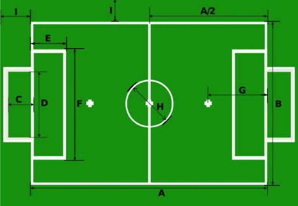
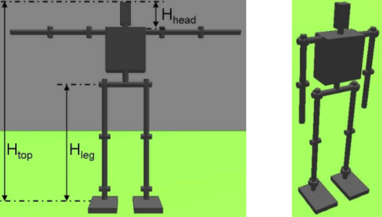

# RoboCup Soccer Humanoid League Law of the Game
RoboCup Humanoid League Mailing List (for important announcements):  
[https://mailman.cc.gatech.edu/mailman/listinfo/robocup-humanoid](https://mailman.cc.gatech.edu/mailman/listinfo/robocup-humanoid)  
 
RoboCup Humanoid Forum (for rule discussion and questions):  
https://hl.forum.robocup.org  
 
RoboCup Humanoid League Home Pages:  
https://www.robocuphumanoid.org/  
https://www.robocup.org/leagues/3  
 
Inspired by the Laws of the Game of the International Football Association Board,  
with amendments for the RoboCup Humanoid League.  

## 概要
+ Section I – Laws of the Game
+ Section II – RoboCup Humanoid League Competition Rules
+ Section III – Rules for RoboCup Humanoid League Technical Challenges

## 目次
### Section I: Laws of the Game

Law 1 ・ The Field of Play  
Law 2 ・ The Ball  
Law 3 ・ The Players  
Law 4 ・ The Players (’Equipment)
Law 5 ・ The Referee  
Law 6 ・ The Assistant Referees  
Law 7 ・ The Duration of the Match  
Law 8 ・ The Start and Restart of Play  
Law 9 ・ The Ball In and Out of Play  
Law 10 ・ The Method of Scoring   
Law 11 ・ Offside (suspended)  
Law 12 ・ Fouls and Misconduct  
Law 13 ・ Free Kicks  
Law 14 ・ The Penalty Kick    
Law 15 ・ The Throw-In  
Law 16 ・ The Goal Kick  
Law 17 ・ The Corner Kick  

Procedures to Determine The Winner of a Match or Home-And-Away  
The Technical Area  
The Fourth Official and the Reserve Assistant Referee  
The Additional Assistant Referee  
### Section 2: RoboCup Humanoid League Competition Rules
The Competitions and Trophies
### Section 3: Rules for RoboCup Humanoid League Technical Challenges
General Rules for Technical Challenges   
Part A: Push Recovery   
Part B: Goal-Kick from Moving Ball  
Part C: High Jump  
Part D: High-Kick Challenge  

## Laws of the Game
ゲームの法則は、最新のFIFAドキュメントを参照するように定期的に更新する必要があります。  
FIFAルールからの逸脱は、テキストでマークされています。  
「replace」：RoboCup固有のルールは、FIFAルールを一時的に置き換えます。   
「suspend」：特定のFIFAルールはまだ適用されていません。   
「new」：RoboCup固有のルールが一時的に導入されました。  

### ゲームの法律に関する注意事項
#### 修正点
関係する会員協会の合意に従い、これらの法律の原則が維持されている場合、法律は地域の一致の申請において修正される場合があります。 次の変更のいずれかまたはすべてが許可されます。  
+ 競技場のサイズ
+ ボールのサイズ、重量、素材
+ ゴールポスト間の幅と地面からのクロスバーの高さ
+ プレイ期間の長さ
+ subsitutions
#### 男性と女性
レフリー、アシスタントレフリー、およびオフィシャルに関する参照は、元のFIFA文書からジェンダーに中立な言語に変更されました。 プレーヤーへの言及は、この文脈ではロボットを指すため、男性の性別で保持されています。 ただし、FIFAがゲームのすべての参加者に関して将来的に完全にジェンダーニュートラルな言語になるように、ゲームの法律を公式に変更することを強くお勧めします。  
（置換：審判、アシスタント審判、選手および役員に関するゲームの法則における男性の性別への言及は、単純化のためであり、男性と女性の両方に適用されます。）
#### 公用語
RoboCup Humanoid League技術委員会は英語でゲームの法則を公開
#### 鍵
左側の余白の1行は、新しい法律の変更を示します。  
 
## Law 1 – The Field of Play
### フィールド面
試合は、約30 mmの高さの人工表面でプレイできます
人工表面の色は緑でなければなりません。
### フィールドマーキング
競技場は長方形で、線でマークされている必要があります。 これらの線は、境界となる領域に属します。  
2本の長い境界線はタッチラインと呼ばれます。 2本の短い線はゴール線と呼ばれます。  
プレイフィールドは、2本のタッチラインの中間点を結ぶ中間線によって2つの半分に分割されます。  
中心マークは、中間線の中間点に示されます。 KidSize~~およびTeenSize~~の半径が0.75 m、AdultSizeの半径が1.5 mの円がその周りにマークされます。  
### 次元
タッチラインの長さは、ゴールラインの長さよりも大きくなければなりません。  
KidSizeとTeenSizeの試合  
長さ（タッチライン）：約9 m  
幅（ゴールライン）：約6 m  
すべての線は同じ幅である必要があり、約5 cmでなければなりません  
AdultSizeの試合
長さ（タッチライン）：約14 m  
幅（ゴールライン）：約9 m  
### ゴールエリア
各ゴールポストの内側からKidSizeでは0.2m AdultSizeでは0.7mの２本の線がゴールラインに直角に描画されます。　~~各ゴールポストの内側から1.2 mの位置に、ゴールラインに直角に2本の線を引きます。~~ これらの線は、1 mの距離でフィールド内に広がり、ゴールラインと平行に描かれた線でつながっています。 これらのラインとゴールラインで囲まれたエリアがゴールエリアです。  
### ペナルティエリア
<u>各ゴールポストの内側からKidSizeは1.2m AdultSizeは0.7mの２本の線がゴールラインに直角に描画されます。</u>ペナルティマークは、AdultSizeでは2.1m、KidSizeおよびTeenSizeでは1.5mで、ゴールポストとそれらから等距離の中間点から作成されます。
### フラッグポスト
### コーナーアーク
### ゴール
ゴールは、各ゴールラインの中央に配置する必要があります。 ゴールは、コーナーフラッグポストから等距離にあり、上部で水平クロスバーによって結合された2つの直立したポストで構成されます。 ゴールポストとクロスバーは、木材、金属、またはその他の承認された材料で作られている必要があります。 それらは正方形、長方形、円形、楕円形でなければならず、プレイヤーにとって危険であってはなりません。 支柱間の距離は2.6 mで、クロスバーの下端から地面までの距離は~~1.8 mです。~~ KidSizeは1.2m,AdultSizeは1.8mです。
ゴールポストの形状が正方形（上から見た場合）の場合、側面はゴールラインに平行または垂直でなければなりません。 クロスバーの側面は、フィールドプレーンに対して平行または垂直でなければなりません。 ゴールポストの形状が楕円形の場合（上から見た場合）、最長軸はゴール165ラインに垂直でなければなりません。 クロスバーの最長軸は、フィールドプレーンに平行でなければなりません。 ゴールポストの形状が長方形（上から見た場合）の場合、最長辺はゴールラインに垂直でなければなりません。 クロスバーの最も長い辺は、フィールドプレーンに平行でなければなりません。 ゴールポストとクロスバーの幅と深さは同じで、12 cm（5インチ）を超えません。 ゴールラインの幅は約5 cmでなければなりません。
緑または白であってはならないネットは、適切にサポートされ、ゴールキーパーに干渉しない限り、ゴールとゴールの背後の地面に取り付けられます。（新）
ゴールポストとクロスバーは白でなければなりません。
### 安全性
ゴールはしっかりと地面に固定する必要があります。 ポータブルのゴールは、この要件を満たす場合にのみ使用できます
### プレイフィールド
  

|   |                        | kidsize | AdultSize |
|---|------------------------|---------|-----------|
| A | Field length           | 9m      | 14m       |
| B | Field wodth            | 6m      | 9m        |
| C | Goal depth             | 0.6m    | 0.6m      |
| D | Goal width             | 2.6m    | 2.6m      |
|   | Goal height            | 1.8m    | 1.8m      |
| E | Goal area length       | 1m      | 1m        |
| F | Goal area width        | 5m      | 5m        |
| G | Penalty mark distance  | 1.5m    | 2.1m      |
| H | Center circle diameter | 1.5m    | 3m        |
| I | Border strip width     | 0.7m    | 1m        |
| J | Penalty area length    | 0.7m    | 1m        |
| K | Penalty area width     | 0.7m    | 1m        |

### 光の状態
照明は人工照明でも自然照明でもかまいません。
### コーナーフラッグポスト
---
### メトリック測定
---
### インペリアル測定
---
### 国際F.A.理事会の決定
---
## Law 2 – The Ball
### 品質と測定
ボールは：
+ 球状 
+ 革または他の適切な材料で作られた
+ KidSizeのFIFAサイズ1、~~TeenSizeのサイズ3~~、AdultSizeリーグのサイズ5。
### 欠陥のあるボールの交換
試合中にボールが破裂したり、欠陥が生じた場合：
+ 試合は中止されます
+ 元のボールに欠陥が生じた場所に交換用ボールをドロップすることにより、試合が再開されます。プレーがゴールエリア内で停止された場合を除き、その場合、審判はプレーが停止されたときに元のボールがあった場所に最も近いポイントでゴールラインに平行なゴールエリアラインに交換用ボールをドロップします。

ペナルティキック中、またはペナルティマークからのキック中にボールが破裂したり、ボールが前方に移動して、プレーヤーまたはクロスバーまたはゴールポストに触れる前にボールが破損した場合：
+ ペナルティキックが再び行われます

キックオフ、ゴールキック、コーナーキック、フリーキック、ペナルティキックまたはスローインでプレーしていない間にボールが破裂したり、欠陥が生じた場合：
+ 試合は2チームで行われ、各チームはKidSizeで4人以下、~~ TeenSizeで3人以下~~, AdultSizeで2人以下で、そのうち1人はゴールキーパーとして指定する必要があります。 いずれかのチームが1人未満のプレイヤーで構成されている場合、試合は開始されない場合があります。 チームのフィールドの横に少なくとも1人のプレーヤー（プレーできない可能性がある）がいない場合、それは没収と見なされます。   

## Law 3 – The Players
### プレイヤーの数
試合は2チームで行われ、各チームはKidSizeで4人以下、~~TeenSizeで3人以下~~、AdultSizeで2人以下で、そのうち1人はゴールキーパーとして指定する必要があります。 いずれかのチームが1人未満のプレイヤーで構成されている場合、試合は開始されない場合があります。 チームのフィールドの横に少なくとも1人のプレーヤー（プレーできない可能性がある）がいない場合、それは没収と見なされます。
### 交代数
**公式大会**  
FIFA、コンフェデレーションズ、またはメンバー協会の後援のもとで開催される公式競技会で行われる試合では、最大2人の交代選手が使用できます。 コンテストのルールには、2人から最大12人までの候補者を指名できる数を明記する必要があります。  
### 交代手順
すべての試合で、試合の開始前に代理人の名前が審判に与えられなければなりません。 現時点でレフリーに名前が与えられていない交代選手は、試合に参加できません  　
プレーヤーを代替選手と交換するには、次の条件を順守する必要があります。
+ 提案された置換が行われる前に、審判に通知されなければならない
+ 交代選手は、交代中のプレーヤーが退場し、審判からの信号を受け取った後にのみ、フィールドに入る
+ 交代要員は、プレーヤー自身のハーフのペナルティーマークで、試合の中断中にのみフィールドに出ます。
+ 交代がフィールドに入ったときに交代が完了する
+ その瞬間から、交代選手が選手になり、彼が交代した選手が交代選手になります
+ すべての代理人は、プレーすることが求められているかどうかにかかわらず、審判の権限と管轄権の対象となります。

### ゴールキーパーの変更
他のプレイヤーは、次の条件を満たせば、ゴールキーパーと一緒に場所を変更できます  
+ 審判は、変更が行われる前に通知されます
+ 変更は試合の停止中に行われます
### 侵害と制裁
交代または交代した選手またはチーム役員がレフリーの許可なしにフィールドに入った場合：
+ レフリーはプレイを停止します（ただし、代替または代替プレイヤーがプレイに干渉しない場合はすぐにではありません）
+ 審判は彼のスポーツに反する振る舞いを警告し、彼にフィールドを去るよう命令する
+ レフリーがプレーを停止した場合、停止時のボールの位置から相手チームの直接フリーキックで再開されます（法13 –フリーキックの位置を参照）

試合の開始時に、指名された選手の代わりに指名された交代選手がフィールドに入って、審判にこの変更が通知されない場合：
+ レフリーは、指名された選手が試合を続けることを許可する
+ 指名された代理人に対する懲戒処分は行われません
+ 違反チームが許可する交代回数は減りません
+ 審判は適切な当局に事件を報告する

プレーヤーが変更前にレフリーの許可なしにゴールキーパーで場所を変更した場合：
+ 審判はプレーの継続を許可する 
+ 審判は、ボールが次にアウトオブプレーになったときに、関係する選手に警告する

この法律のその他の侵害があった場合：
+ 関係するプレイヤーは注意されています
+ 試合は、間接フリーキックで再開され、対戦相手チームのプレーヤーは、停止時のボールの位置から行われます（法律13 –フリーキックの位置を参照）

### 退場した選手と代理人
キックオフの前に退場させられたプレーヤーは、指定された交代選手の1人によってのみ交換できます。  
キックオフの前またはプレーが開始された後、退場させられた指名された代理人は、交代できません。

## Law 4 - The Players
### 安全性
プレイヤーは、自分自身や他のプレイヤー（あらゆる種類の宝飾品を含む）に危険なものを装備したり、身につけたりしてはなりません。  
### ロボットの設計（新規）
図2に示すように、ヒューマノイドリーグの競技に参加するロボットは、人間に似たボディプランを持っている必要があります。これらは、トランクに取り付けられた2本の脚、2本の腕、1本の頭で構成されている必要があります。  
（新規:)  KidSize  ~~Teensize~~ のサブリーグのロボットは、安全に持ち上げられ、ロボットとハンドラーに害を与えないために、ハンドルを装備する必要があります。  
  
ロボットは、直立して立ち、足で歩くことができなければなりません。 KidSizeロボットと ~~TeenSizeロボットは~~ 、転倒から立ち直れる（立ち位置に戻る）必要があります。 許可されている移動モードは、二足歩行、ランニング、ジャンプのみです。  
ロボットのすべてのアクションは、ヒューマノイドの運動と運動学的に同等でなければなりません  
 ロボットには緊急停止ボタンが装備されている必要があります。緊急停止ボタンを使用すると、ロボットはすぐにすべての動作を停止するか、理想的にはぐったりしたり、アクチュエータの電源を切ったりします。 緊急停止ボタンに加えて、ロボットには最大2つの追加の物理または仮想ボタンがあります。1つはロボットの動作を開始し、もう1つは動作を停止します。 ボタンには明確にラベルを付ける必要があります。 ロボットに取り外しできないボタンがさらにある場合は、ゲーム中にそれらを視覚的にマスクする必要があります。   
### ロボットの高さ（新規）
Htopに基づいて、次のサイズ制限が適用されます。
+  $ 40 cm <= H_{top} <= 100 cm $ :kidsize
+  $80cm <= H_{top} <= 140cm $ ~~:Teensize~~  
+  $100cm <= H_{top} <=200cm $ _ :AdultSize 

Htopは、直立したときのロボットの高さ（完全に膝を伸ばした状態、図2右を参照）と定義され、HCOMは、直立姿勢で測定されたロボットの重心の高さを示します。 Htopは、ロボットの頭部が最大上向き傾斜角または水平線365のいずれか低い方に傾斜するようにロボットの頭を向けて測定されます。
### 重量制限（新規）
+ ~~  TeenSizeクラスでプレーできるロボットの最大重量は20 kgです ~~
+ ~~  AdultSizeクラスでプレーできるロボットの最小重量は10 kgです ~~  

ロボットのBMI、Body-Mass Indexは次のように定義されます。$ BMI = M / Htop^2 $。  ここで、Mはロボットの質量（kg）、Htopの高さ（メートル）です。 次の制限が適用されます   

+ $5 <= BMI <= 30$
  
### サイズ制限（新規）
ヒューマノイドリーグに参加するすべてのロボットは、次の制限に従う必要があります。
+ 各足は、エリア$ 1/32（2.2・H_{COM})^2 $ の長方形に収まる必要があります。 足は、足首関節の下のすべての機械部品を覆う最小のカプセル化する長方形として定義されます。 カプセル化する長方形は、足の底部接触面に平行な平面にある必要があります。
+ カプセル化する四角形の最長辺と最短辺の比率は、1.2〜3.5である必要があります。
+ ロボットは、直径0.55・H_{top}のシリンダーに収まる必要があります。
+ ロボットは、$ 1.5・H_{top} $より長く延長される構成を持たない。
+ 脚を含む脚の長さ $ H_{leg} $ は、$ 0.35 \times H_{top} <= H_{leg} <= 0.7 \times H_{top} $を満たします。
+ 首を含む頭の高さ$ H_{head} $は、$ 0.05 \times H_{top} <= H_{head} <= 0.25 \times H_{top} $を満たます。　$ H_{head} $ は、肩の最初のアームジョイントの軸から頭頂部までの垂直距離として定義されます。 
+ 脚の長さは、ロボットがまっすぐ立っている間に測定されます。 長さは、最初の回転ジョイントから測定されます。このジョイントの軸は、立っている地面に平行な平面にあり、足の先端までです。 
+ 最初の関節から測定した腕の最小長は、$ H_{top} - H_{leg} - H_{head} $です_。

### センサー（新規）
ヒューマノイドリーグ大会に参加するチームは、人間の感覚で同等のセンサーをロボットに装備することが推奨されます。 これらのセンサーは、人間の生物学的センサーの位置とほぼ同等の位置に配置する必要があります。 特に、
+ 許可されている唯一のアクティブな外部センサーは、ロボットの1つのスピーカーによる音（音量と周波数に関して「人間のような」音）です。 スピーカーは、ロボットの頭、首、または胴体に配置できます。 他のアクティブなセンサー（400回の反射を測定するために環境に光、音、または電磁波を放射する）は許可されません。
+ カメラや最大2つのマイクなどの外部センサーは、ロボットの脚や腕、または胴体に配置することはできません。 それらは、ロボットの頭と首の関節の上に配置する必要があります。
+ カメラの数は、ステレオビジョン設定（つまり、オーバーラップが大きい最大2台のカメラ）に制限されています。 単眼視も許可されています。
+ ロボットの視野は常に180度に制限されています。 これは、ロボットに取り付けられたすべてのカメラの視野の結合内の2点間の最大角度が180度未満でなければならないことを意味します。 また、頭部とロボットの頭部に取り付けられたカメラのパンチルト動作は、視野だけでなく、首の関節の動作範囲に関しても、より人間的なものに制限されています。 したがって、カメラをパンするメカニズムは270度のパンに制限されます。これは、410を真正面から見た位置から±135度を意味します。 カメラを傾けるメカニズムは、±90度に制限されています（水平線から測定）。 さらに、中心マークに配置されている場合、ロボットは、任意の傾斜角およびロボットの任意の立ち姿勢または歩行姿勢で3つ以上のゴールポストを見ることができない場合があります。
+ タッチセンサー、力センサー、温度センサーは、ロボットの任意の位置に配置できます。
+ ロボット内部のセンサーは、電圧、電流、力、動き、加速度、回転速度を含む（ただし、415に限定されない）システムのローカル状態を表すすべての量を測定できます。 ロボット内の任意の位置に配置できます。 地磁気センサーからの測定値はソフトウェアで使用できません。疑わしい場合は、技術委員会のメンバーが検査のためにコードを利用できるようにする必要があります。

### 通信および制御（新規）
ヒューマノイドリーグ大会に参加するロボットは、大会の開催中に自律的に行動する必要があります。 外部電源、遠隔操作、リモートコントロール、またはあらゆる種類のリモートブレインは許可されません。  
ロボットは、主催者が提供する無線ネットワークを介してのみ通信できます。主催者はレフェリーボックスをサポートする必要があります。 1つのチームに属するロボットの合計帯域幅は、1メガビット/秒を超えてはなりません。 ロボットは、無線ネットワークの品質に依存してはいけません。 ネットワークの品質が低い場合は、プレイできる必要があります。 ロボットのみがWLANで通信できます。 チームメンバーの他のコンピューターは、テザーLANでのみ通信できます。 他の無線通信はオンサイトで許可されていません。 他のすべてのワイヤレスハードウェアは非アクティブにする必要があります。 チームメンバーの1人がこの規則に違反すると、チームは失格となる場合があります。  
 
プレイ中のロボットは、ゲーム中いつでも相互に通信できます。 現在動作していないロボットは、ネットワークを介して自分の内部ハードウェアまたはソフトウェア機能に関するステータスの更新のみを送信できます。 ゲーム関連の情報を伝えない場合があります。 外部コンピューターまたはアウトオブプレイロボットからプレイ中のロボットへのいかなる種類の送信も禁止されています。 これは、テザーLANで公式のワイヤレスルーターに接続された外部コンピューターを使用して、ロボットからUDP通信を受信することによってのみ監視が行われることを意味します。  
  
外部コンピューターからロボットへの直接または間接的な送信は、タイムアウト中または一時的な不在中および競技場外で行う必要があります。 ロボットハンドラーまたは別のチームメンバーがロボットに触れたり、ケーブルが接続されたり、ロボットとの別の形式の通信（ボタンのクリックを含む）が行われたりすると、ロボットは稼働中と見なされます。 通常のペナルティ時間は、ロボットとのあらゆる種類の通信が終了した後にのみカウントを開始し、ロボットハンドラーがロボットのサービスを再試行するたびにリセットされます。 代替ロボットは、プレイ中のロボットにゲーム関連情報を誤ってまたは意図的に送信しないように、フィールドから遠ざかる必要があります。 
 
チームは、口頭でのコミュニケーションを除く、プレイ中のロボット、サービス中のロボット、またはロボットの現在のゲーム状態を検出する自律性の必要性を減らす情報を含む30秒のペナルティ時間を提供するロボットとのコミュニケーションを使用してはなりません ボールの位置、ロボットがフィールドに再入場する場所、ロボット自身または対戦相手のゴールの方向、チームメンバーまたは対戦相手の位置。 チームがこの規則に違反している疑いがある場合は、コードを検査のために445技術委員会のメンバーが利用できるようにする必要があります。  
 
ゲーム中、公式のゲームコントローラー/審判員ボックスが使用されます。 UDPを使用して、経過時間、現在のスコア、ゲームの状態（準備、設定、プレー、終了）、ロボット固有のペナルティ状態などの情報をロボットにブロードキャストします。 ソースコードは開いています。 チームはルールを尊重するために審判ボックスを使用できる必要があります。   ~~チームに審判ボックスの使用を促すために、ゲームの停止中に審判ボックスを使用するチームには15秒の利点が与えられます。~~   
  
KidSize ~~とTeenSize~~ では、ボールがインプレーである間、フィールドに人間を置くことはできません。 ロボットハンドラーは指定されたエリアに留まり、フィールドに入る前に審判から許可を得る必要があります。 各チームは、ロボットハンドラーとして1人のみを指定できます。 チームのロボットハンドラーは、そのロボットへの（意図的または意図的でない）損傷を避けるために、他のチームのロボットに触れてはなりません。  
 
ゲームコントローラの審判ボックスのソースコードは、次から入手できます。
+ https://github.com/RoboCup-Humanoid-TC/GameController, see also
+ https://www.robocuphumanoid.org.

### （中断：基本装備

### （中断：シンガード

### 色
+ （新規）ロボットは、ほとんどが黒またはダークグレー（つまり、RAL 7011アイアングレーまたはそれ以上）で、反射しないものでなければなりません。 ロボットは、アルミニウムのようなシルバー、グレー、または白で色付けすることもできますが、その場合、足は黒に色付けする必要があります。 フィールドに使用されている色（緑、白）、または相手チームのチームマーカーに類似した色は使用しないでください。 ロボットの腕、脚、および体は、立体形状である必要があります。
+ （新規）ロボットはチームマーカーでマークする必要があります。 これらのマーカーは、一方のチームでは赤、もう一方のチームでは青で表示されます。 ロボットの腕、脚、胸を組み合わせたすべてのチームマーカー（最大20）の合計可視領域は、少なくとも0.06・Htop 2でなければなりません。 各側（左、右、前、および後ろ）にある1〜5つの最大のチームマーカーの可視領域は、少なくとも0.015・Htop 2でなければなりません。 両方のチームがどちらのチームの色を使用するかに同意できない場合、ゲームの1時間前にコインが反転され、チームの色が割り当てられます。
+ （新規）各チームのロボットは一意に識別可能でなければなりません。 番号または名前でマークする必要があります。 ゴールキーパーロボットは、審判がチームの他のロボットと簡単に区別できるように一意にマークする必要があります。
+ 2つのチームは、互いに区別する色と、レフリーとアシスタントレフリーを着用する必要があります

### 侵害と制裁
この法律に違反した場合：
+ プレイを停止する必要はありません
+ 障害のあるプレーヤーは、審判からフィールドを離れて装備を修正するように指示されます。
+ プレーヤーは、自分の装備をすでに修正していない限り、次にボールがインプレーになったときにプレーの場を離れる
+ 競技場を離れて装備を修正する必要があるプレーヤーは、審判の許可なしに再入場してはならない
+ 審判は、プレーヤーが競技場に再び入ることを許可する前に、プレーヤーの装備が正しいことを確認します。
+ 審判は、プレーヤーが競技場に再び入ることを許可する前に、プレーヤーの装備が正しいことを確認します。
+ この法律の違反のためにフィールドを離れる必要があり、レフリーの許可なしにフィールドに再入場するプレーヤーは注意が必要です。

### 試合再開
審判が注意してプレーを停止した場合：
+ 試合は、審判が試合を止めたときにボールがあった場所から相手チームのプレーヤーがとった間接フリーキックによって再開されます（法13 –フリーキックの位置を参照）

### 国際F.A.理事会の決定
決定1  
プレイヤーはスローガンや広告を示す下着を見せてはいけません。 基本的な必須装備には、政治的、宗教的、または個人的な声明があってはなりません。 スローガンや広告を明らかにするためにジャージやシャツを脱いだプレーヤーは、競技主催者によって制裁されます。 基本的な必須装備520に政治的、宗教的、または個人的なスローガンまたは声明が記載されているプレーヤーのチームは、競技主催者（新規）またはロボカップ連盟ヒューマノイドリーグによって制裁されます。

## Law 5 – The Referee
### 審判の権限
+ 各試合は、任命された試合に関連してゲームの法則を施行する完全な権限を持つレフェリーによって管理されます。 ゲームの法則とゲームの精神に基づいて、審判の能力を最大限に引き出す決定が行われ、審判の法則の枠内で適切な行動をとる裁量を持つ審判の意見に基づいて決定されます。

### 権限と義務
審判は:
+ ゲームの法則を施行する
+ アシスタントレフリーと、該当する場合は4人目のオフィシャルと協力して試合を管理します
+ 使用するボールが法律2の要件を満たしていることを確認します
+ プレーヤーの機器が法律4の要件を満たしていることを確認します
+ タイムキーパーとして機能し、試合の記録を保持します
+ 法律の違反により、その裁量で試合を停止、中断、または放棄する
+ あらゆる種類の外部干渉のために試合を停止、一時停止、または放棄する
+ 彼らの意見では、プレーヤーが重傷を負った場合、試合を中止し、彼がプレーのフィールドから除去されることを保証します。 負傷したプレーヤーは、それぞれのペナルティー時間が終了した後にのみフィールドに戻ることができます。
+ プレーヤーが自分の意見ではわずかに負傷している場合、ボールがアウトオブプレーになるまでプレーを続けることができます
+ 傷から出血しているプレイヤーがフィールドから離れることを保証します。 プレーヤーは、審判からの信号を受信したときにのみ戻ることができます。審判は、出血が止まったことに満足しなければなりません
+ オフェンスがコミットされたチームがそのようなアドバンテージから利益を得たときにプレイを続行し、その時点で予想されるアドバンテージが続かない場合は元のオフェンスにペナルティを科す
+ プレーヤーが同時に複数の違反を犯した場合、より深刻な違反を罰する
+ 警戒すべき、または退場する犯罪を犯したプレイヤーに対して懲戒処分を行います。 彼らはすぐにこのアクションを取る義務はありませんが、ボールが次にアウトオブプレーになったときにそうしなければなりません
+ 責任ある方法で行動することに失敗したチーム役員に対して行動を起こし、彼らの裁量で、彼らを競技場とそのすぐ近くから追い出す可能性があります
+ アシスタントレフリーの見たことのないインシデントに関するアドバイスに基づいて行動する
+ 権限のない人がフィールドに入らないようにします
+ 停止後の試合の再開を示します
+ 適切な当局に試合レポートを提供します。これには、プレーヤーやチーム役員に対して行われた懲戒処分、および試合前、試合中、または試合後に発生したその他の事件に関する情報が含まれます

### 審判の決定
ゴールが得点されたかどうか、試合の結果など、プレーに関連する事実に関する審判員の決定は最終的なものです。  
 
審判は、プレーを再開したり試合を終了したりしない限り、間違っていることを認識するか、裁量で副審または第4オフィシャルのアドバイスに基づいて決定を変更することができます。  
  

### 国際F.A.理事会の決定
決定1  
審判（または該当する場合、アシスタントレフリーまたは4人目のオフィシャル）は、以下について責任を負いません。
+ プレーヤー、オフィシャル、観客が被ったあらゆる種類の怪我
+ あらゆる種類の財産への損害
+ 個人、クラブ、会社、協会、またはその他の団体が被ったその他の損失、これは期限が到来するか、または期限が到来する可能性があるもの
+ 575ゲームの法律の条件の下で、または通常の手順に関して行うことができる決定
+ 試合を開催、プレイ、コントロールするために必要です。

そのような決定には以下が含まれます。
+ 競技場またはその周辺の状況、または試合の開催を許可するかどうかなどの気象条件であるという決定 
+ 何らかの理由で試合を中止する決定
+ 試合中に使用されるフィールド機器とボールの適合性に関する決定
+ 観客の干渉または観客エリアの問題のために試合を中止するか中止しないかの決定
+ 負傷したプレーヤーを治療のためにプレーの場から外すためにプレーを停止するかどうかの決定
+ 負傷したプレーヤーを治療のためにプレーの場から外すことを要求する決定
+ プレイヤーが特定のアパレルや機器を着用することを許可するかどうかの決定
+ （チームまたはスタジアムの役員、警備員、写真家、または他のメディアの代表者を含む）人が競技場の近くにいることを許可するかどうかの決定（権限がある場合）
+ ゲームの法則に従って、または試合が行われるFIFA、コンフェデレーション、メンバー協会、またはリーグの規則または規則の条件に基づいて彼らが果たすべきその他の決定

決定2  
4人目の役員が任命されるトーナメントまたは競技会では、その役割と義務は、この出版物に含まれる国際F.A.理事会によって承認されたガイドラインに従わなければなりません。  
 
決定3  
ゴールラインテクノロジー（GLT）が使用されている場合（それぞれの競技規則に従います）、審判は試合前にテクノロジーの機能をテストする義務があります。 実行されるテストは、GLTテスト用FIFA品質プログラムマニュアルに記載されています。 技術がテストマニュアルに従って機能しない場合、審判はGLTシステムを使用してはならず、この事件をそれぞれの当局に報告しなければならない。  

## Law 6 – The Assistant Referees
### 職務
2人のアシスタントレフリーが任命される場合がありますが、その職務はレフリーの決定に従い、以下を示すものとします。
+ ボール全体がフィールドから出るとき
+ どのチームがコーナーキック、ゴールキック、またはスローインの資格があるか
+ プレーヤーがオフサイドの位置にいることでペナルティを科される場合
+ 代替が要求されたとき
+ 不正行為またはその他の事件が審判の視界から外れた場合
+ アシスタントレフェリーがレフリーよりも良い視界を持っているときはいつでもオフェンスがコミットされたとき（これには、特定の状況では、ペナルティーエリアで行われたオフェンスが含まれます）
+ ペナルティーキックで、ボールが蹴られる前にゴールキーパーがゴールラインから移動したかどうか、またボールがラインを越えた場合
+ （新規）ゲームコントローラーの操作

### アシスタント
アシスタントレフリーはまた、ゲームの法則に従って試合をコントロールするレフリーを支援します。 特に、彼らはゲームの法則で定義されているように距離を制御するのを助けるためにプレイフィールドに入ることができます  
 
過度の干渉または不適切な行為が発生した場合、レフリーはアシスタントレフリーの職務を軽減し、適切な当局に報告します。

## Law 7 – The Duration of the Match
### プレイ時間
試合は、審判と2つのチームの間で相互に合意しない限り、10分の2つの等しい期間続きます。 プレイ期間の長さを変更するための合意は、プレイの開始前に行われなければならず、競技規則を遵守しなければなりません。

### インターバル
+ プレイヤーはハーフタイムでインターバルを獲得する権利があります。
+ ハーフタイム間隔は5分を超えてはなりません。
+ 競技規則には、半時間間隔の期間を明記する必要があります。
+ ハーフタイム間隔の期間は、審判の同意がある場合にのみ変更できます。

### ロスタイム
いずれかの期間に、次のことによって失われたすべての時間に対して許可が行われます
+ 交代
+ 選手の負傷の評価
+ 治療のために負傷した選手を競技場から排除する
+ 時間を無駄にした
+ その他の原因
失われた時間に対する手当は、審判の裁量による。

### ペナルティーキック
ペナルティーキックを行うか、またはリテイクする必要がある場合、ペナルティーキックが完了するまで、どちらかの半分の期間が延長されます。

### 放棄された試合
競技規則に別段の定めがない限り、放棄された試合が再生されます

## Law 8 – The Start and Restart of Play 
キックオフは、試合の両方の半分、余分な時間の両方を開始し、ゴールが得られた後にプレーを再開します。  
フリーキック（直接または間接）、ペナルティキック、スローインゴールキック、コーナーキックは他の再開です（法律13-17を参照）。  
ボールがインプレーでないときに侵害が発生しても、プレーの再開方法は変わりません。  

### キックオフの定義
キックオフは、プレイを開始または再開する方法です.  
+ 試合開始時
+ ゴールが決められた後
+ 試合の後半の開始時に
+ 余分な時間の各期間の開始時に、該当する場合
（新規:)キックオフを行ったチームがキックオフから直接得点することはできません。 ボールが完全に中央の円の外側に移動するか、ゴールに蹴られる前に別のプレーヤーが触れなければなりません。 ボールが直接ゴールに蹴られた場合、相手チームにゴールキックが与えられます。  

### 手順
試合開始時または延長戦のキックオフ前
+ コインがトスされ、トスに勝ったチームが試合の前半でどのゴールを攻撃するかを決定します。
+ 他のチームはキックオフを取り、試合を開始します。
+ トスに勝ったチームはキックオフを取り、試合の後半を開始します。
+ 試合の後半では、チームは終わりを変えて反対の目標を攻撃します

キックオフ
+ チームがゴールを決めた後、キックオフは他のチームによって行われます。
+ すべてのプレイヤーは自分のフィールドの半分にいる必要があります
+ キックオフを行うチームの対戦相手は、それがインプレーになるまでセンターサークルの外側にいます
+ キックオフを行うチームの相手は、ボールがインプレーになるまでボールから少なくとも9.15 m（10ヤード）離れている）
+ ボールはセンターマーク上で静止している必要があります
+ レフリーが合図をする
+ ボールが蹴られて明確に動くときにボールがインプレーである（新規：審判または10秒後に決定される審判が合図をした）

### 侵害と制裁
キックオフ手順にその他の違反があった場合
+ キックオフが再び行われます
+ ドロップボールの定義
+ ドロップされたボールは、ボールがまだプレー中にあるときに、レフリーがゲームの法則に記載されていない何らかの理由でプレーを一時的に停止する必要がある場合にプレーを再開する方法です。

### 手順
ゲームはセンターマークで継続されます。 ドロップされたボールから直接ゴールを決めることができます。 ドロップされたボールの手順はキックオフの手順と同じですが、両方のチームのプレーヤーはセンターサークルの外にいなければなりません。 レフリーが合図を出した直後にボールがインプレーになります。 審判が合図を出す前にプレーヤーがボールに近づきすぎると、キックオフが相手チームに与えられます。

### 侵害と制裁
ボールが再びドロップされます。
+ 地面と接触する前にプレーヤーが触れた場合
+ ボールが地面に接触した後、プレーヤーが触れずにボールがフィールドから出た場合

## Law 9 – The Ball In and Out of Play
### アウトボール
次の場合、ボールはアウトオブプレーです。
+ 地上でも空中でもゴールラインまたはタッチラインを完全に横切った場合
+ 審判がプレーを停止した場合

### インプレー
ボールは他のすべての時間にインプレーになります。
+ 試合の公式、ゴールポスト、クロスバー、コーナーのフラッグポストから跳ね返り、フィールドに残る

## Law 10 – The Method of Scoring
### 得点
ボールの全体がゴールライン上、ゴールポスト間、クロスバーの下を通過するときにゴールが記録されます。ただし、ゴールを決めたチームが以前にゲームの法則違反を犯していない場合に限ります。 ボールがゴールラインを通過する前にキックロボットにロボットハンドラーが触れた場合、それは「除去ペナルティ」であり、ゴールはカウントされません。 対戦の再開は、対戦チームのゴールキックになります。 ボールがゴールラインを通過する前にロボットハンドラーがチームの別のロボットに触れた場合、それはキッカーではなく、「除去ペナルティ」であり、ゴールはカウントされます。
### 優勝チーム
試合中により多くのゴールを決めたチームが勝者です。 両方のチームが同じ数のゴールを獲得する場合、またはゴールが獲得されない場合、試合が行われます。
### 競争ルール
試合またはホームアンドアウェイタイの後に勝者チームが存在することを競技規則が要求する場合、勝者チームを決定するために許可される唯一の手順は、国際F.A.委員会によって承認されたもの、すなわち：
+ アウェイゴールルール
+ 延長時間
+ ペナルティーマークからキック
+ （新規）ペナルティマークからの延長キック

### ゴールラインテクノロジー（GLT）
GLTシステムは、審判の決定をサポートするためにゴールが記録されているかどうかを確認する目的で使用できます。 GLTの使用は、それぞれの競争規則で規定されている必要があります。

## Law 11 – Offside
**サスペンド中**

## Law 12 – Fouls and Misconduct
直接および間接のフリーキックとペナルティキックは、ボールがインプレーのときに犯した違反と違反に対してのみ授与されます。

### ダイレクトフリーキック
プレーヤーが次の攻撃のいずれかを相手チームのプレーヤーに犯した場合、直接フリーキックが相手チームに与えられます。
+ 歩行および/または蹴りが妨げられるように、プレーヤーを著しく不安定にする強制的な接触を使用します。 強制的な接触の例には、別のプレイヤーに落ちたり、かなりの速度で不注意に別のプレイヤーに歩いたりします。  
+ 「プッシュする力」が最小限であっても、4〜5秒間（転倒したプレイヤーや起床したプレイヤーであっても）他のプレイヤーに歩きます。

次の例外のいずれかが発生した場合、フリーキックは授与されません。
+ キックモーションの開始時にキックが成功する可能性のある場所にボールが十分に近ければ、キックをしているプレーヤーを含め、オフェンスを行うプレーヤーは静止しています。
+ オフェンスをコミットしているプレイヤーは現在起きています。
+ オフェンスを犯したプレーヤーが現在のゴールキーパーであり、現在、自分のペナルティーエリアでボールを見ているか、追いかけています。
+ プレーヤーがボールを挟んで正面から正面に接触しても、一方のプレーヤーが非常に速い速度で、または他方のプレーヤーの前に立つことが不可能なほど大きな力で歩く場合を除き、フリーキックにつながりません。
+ サイド（腕、肩など）が他のプレーヤーと接触するボールに向かって進んでいるプレーヤーは、たとえ2番目のプレーヤーがボールに進んでいない場合でも、違反を犯しません。
+ 自分に対してオフェンスを行ったプレーヤーは、同時にフリーキックオフェンスを自分で呼び出すことはできません。

プレイヤーが次の4つの違反（置換：3）のいずれかを犯した場合、直接のフリーキックも相手チームに与えられます。
+ 敵を抱える
+ 相手に吐き出す
+ 故意にボールを処理する（自分のペナルティーエリア内のゴールキーパーを除く）
+ （新規:)ボールをプレーヤーから取り外せないように1秒以上ボールを保持します（ゴールキーパーがボールを地面で最大6秒、片手または両手で10秒持ち上げることができます） 。 ボールを取り外し可能と見なすには、ボールの体積の半分以上がプレーヤーの凸包の外側にあり、地面に投影されている必要があります。 ボールが凸包に繰り返し入る場合、ボールはほとんどの時間の間、取り外し可能でなければなりません。 チームの複数のプレーヤーがボールの近くにいる場合、凸包はチームのすべてのプレーヤーの周りを取り、ボールの除去を防ぎます。

（新規:)半径約10分の範囲内で攻撃が発生しなかった場合。 現在のボール位置の周囲1 mで、直接フリーキックは除去ペナルティに置き換えられます。   
 
 攻撃が発生した場所から直接フリーキックが取られます（法13 –フリーキックの位置を参照）。 （新規:)攻撃が発生した場所にボールを移動すると、フリーキックが与えられたチームの不利になる場合、審判はプレーの継続を許可します。

### ペナルティーキック
プレー中であれば、ボールの位置に関係なく、プレーヤーが自分のペナルティエリア内で上記の6つの違反（置換：10回）のいずれかを犯した場合、法14で定義されているペナルティキック（新規）が与えられます。

### 間接的フリーキック
ゴールキーパーが自分のペナルティエリア内で以下の4つの違反のいずれかを犯した場合、間接フリーキックが相手チームに与えられます。
+ ボールを手から放す前に10秒以上ボールをコントロールします
+ ボールを手から離した後、別のプレーヤーに触れる前に、ボールを手で再度タッチします。
+ チームメイトが故意にボールを蹴った後、ボールを手で触れます
+ チームメイトが取ったスローインから直接ボールを受け取った後、手でボールに触れます

間接フリーキックは、審判の意見としてプレーヤーが次の場合に、相手チームにも与えられます。
危険な方法でプレイする。
+ 対戦相手の進行を妨げる
+ ゴールキーパーがボールを手から離さないようにする
+ 法律12でこれまで言及されていなかった、プレーヤーを警告または退場させるためにプレーが停止されたその他の違反を犯した場合

（新規:)半径約10分の範囲内で攻撃が発生しなかった場合。 現在のボール位置の周囲1 mで、間接フリーキックは除去ペナルティに置き換えられます。間接フリーキックは、違反が発生した場所から取られます（法律13-フリーキックの位置を参照）。
 
（新規:)攻撃が発生した場所にボールを移動することが、フリーキックが与えられたチームの不利になる場合、審判はプレーの続行を許可します。  
 

### 懲戒処分
イエローカードは、プレーヤー、代替または代替プレーヤーが警告されたことを伝えるために使用されます。 レッドカードは、プレーヤー、代替または代替プレーヤーが退場したことを伝えるために使用されます。 赤または黄色のカードを表示できるのは、プレーヤー、代替プレーヤー、または代替プレーヤーのみです。 審判は、彼が競技場に入った瞬間から最後のホイッスルの後に競技場を離れるまで、懲戒処分を受ける権限を持っています。 対戦相手、チームメイト、レフリー、アシスタントレフリー、または他の人のいずれに向けられたものであれ、フィールド上またはフィールド外で、注意深いまたは退場する違反を犯したプレイヤーは、その犯した罪の性質に応じて規律されます。  
レッドカードは、プレーヤー、代替または代替プレーヤーが退場したことを伝えるために使用されます。  
赤または黄色のカードを表示できるのは、プレーヤー、代替プレーヤー、または代替プレーヤーのみです。  
審判は、彼が競技場に入った瞬間から最後のホイッスルの後に競技場を離れるまで、懲戒処分を受ける権限を持っています。  
対戦相手、チームメイト、レフリー、アシスタントレフリー、または他の人のいずれに向けられたものであれ、フィールド上またはフィールド外で、注意深いまたは退場する違反を犯したプレーヤーは、その性質に応じて規律されます  

### 注意すべき違反
次の7つの違反のいずれかを犯した場合、プレーヤーは警告され、イエローカードが表示されます。　　
+ スポーツを行わない行動
+ 言葉または行動による異議
+ ゲームのルールの永続的な侵害
+ プレイの再開を遅らせる
+ ~~コーナーキック、フリーキック、スローインでプレーを再開したときに、必要な距離を守れない~~
+ 審判の許可なしにフィールドに出入りする
+ ~~審判の許可なしに故意にフィールドを離れる~~

代替プレーヤーまたは代替プレーヤーは、次の3つの違反のいずれかを犯した場合に警告されます。
+ スポーツを行わない行動
+ 言葉または行動による異議
+ プレイの再開を遅らせる

### 送還犯罪
プレーヤー、代理プレーヤー、または代理プレーヤーは、次の7つの違反のいずれかを犯した場合、退場させられます。
+ 深刻なファウルプレイ
+ 暴力行為
+ 相手や他の人に唾を吐く
+ 意図的にボールをハンドリングすることにより、相手チームのゴールまたは明らかなゴールスコアリングの機会を拒否する（これ自分のペナルティエリア内のゴールキーパーには適用されません）
+ ~~プレイヤーのゴールに向かって動いている対戦相手に明らかなゴールスコアリングの機会を拒否することにより、フリーキックまたはペナルティーキックで罰せられる攻撃~~
+ 攻撃的、侮辱的または虐待的な言語および/またはジェスチャーを使用して
+ 同じ試合で二度目の注意を受ける

退場させられた選手、代理選手、または代理選手は、競技場と技術エリアの近くを離れなければなりません。

## Law 13 – Free Kicks
### フリーキックの種類
フリーキックは直接または間接のいずれかです

### 直接フリーキック
ボールがゴールに入る場合：
+ 直接フリーキックが相手のゴールに直接蹴られた場合、ゴールが与えられます
+ 直接のフリーキックがチーム自身のゴールに直接蹴られた場合、コーナーキックが相手チームに与えられます

### 間接フリーキック
~~シグナル審判は、頭の上に腕を上げることで間接フリーキックを示します。キックが行われ、ボールが他のプレーヤーに触れるか、プレーから外れるまで、その位置に腕を維持します。~~  
ボールがゴールに入るゴールは、ボールが蹴られ、審判の判断で明確に動くか、ゴールに蹴られる前に他のプレーヤーが触れた場合にのみ得点することができます。  
+ 間接フリーキックが相手のゴールに直接蹴られた場合、ゴールキックが与えられます
+ 間接的なフリーキックがチームのゴールに直接蹴られた場合、コーナーキックが相手チームに与えられます+ 

### 手順
すべてのフリーキックは、次の場合を除き、違反が発生した場所から取られます。
+ 対戦相手のゴールエリア内での攻撃に対する攻撃チームへの間接フリーキックは、ゴールラインと平行に走るゴールエリアライン上の最も近いポイントから取られます。
+ ゴールエリアのディフェンスチームへのフリーキックは、そのエリアのどこからでも取られます。

ボールは:
+ 静止している必要があります（~~キッカーは、他のプレーヤーに触れるまでボールに再び触れてはいけません~~）
+ キックされたときにインプレーであり、レフェリーの決定に従って明確に移動する。ただし、ペナルティエリアから直接キックされたときにボールがインプレーであるペナルティエリアのディフェンスチームへのフリーキックを除く。 （新規）：どちらの場合も、審判が合図を出してから10秒後、ボールはプレー中とみなされます。

ボールがインプレーになるまで、すべての対戦相手が残っている必要があります
+ KidSize  ~~とTeenSize~~  の場合は少なくとも0.75m、AdultSizeの場合は1.5m（交換：9.15 m（10 yds））、ボールがインプレーになるまで、ゴールポスト間のゴールライン上にある場合を除きます。  
+ 相手のペナルティエリア内のフリーキックのペナルティエリア外

審判はホイッスルを吹いて、「フリーキック」を青または赤で発表し、コールに応じてボールを置きます。ゲームコントローラを操作するアシスタントレフリーは、「ダイレクト/間接フリーキック」ブルー/レッドをクリックします。この段階では、ロボットは頭を動かしてボールを追跡できますが、それ以外の場合は静止したままでなければなりません。このフェーズ中に大幅に移動しているロボットは、フィールドから削除されます。レフリーはコールに応じてボールを置き、「フリーキック準備完了」をアナウンスし、アシスタントレフリーは「直接/間接フリーキックの準備」ブルー/レッドをクリックします。フリーキックをするプレーヤーは、フリーキックの位置を決めるのに最大30秒かかります。フリーキックを行うチームは、プレーヤーがいつでもフリーキックを行う準備ができていることを発表できます。プレーヤーは、ボールから離れるのに少なくとも15秒は保証されています。フリーキックを行うチームが、ロボットがキックオフの準備ができていることを発表していない場合、最大30秒かかる場合があります。依然として違法に配置されている敵ロボットは能力のないプレーヤーと見なされ、30秒の除去ペナルティーでフィールドから除去されなければなりません。審判は、フリーキックを行うチームがロボットの準備ができていることを宣言し、対戦相手が不正に配置されていない場合、15秒が経過する前にフリーキックを実行することを決定できます。フリーキックが実行されると、審判はwhiを鳴らし、アシスタントレフリーは「直接/間接フリーキックの実行」青/赤をクリックします。  

### 侵害と制裁
フリーキックが行われたときに、相手が必要な距離よりもボールに近い場合：
+ 相手は30秒の除去ペナルティを受け取ります（置換：キックが再取得されます）

自身のペナルティエリア内からディフェンスチームがフリーキックを行った場合、ボールはペナルティエリアの外に直接キックされません。
+ ゴールキーパーが時間枠内でボールに到達できた場合、キックは再び行われます（新規:)。 そうでなければ、ボールは再びインプレーになります。

（新規）チームAにフリーキックが与えられ、審判がフリーキックの実行を発表する前にチームAのプレーヤーがボールに触れた場合：
+ ボールはインプレーです。
+ ボールに触れたプレーヤーは警告を受けました。 2回目の警告では、プレーヤーはイエローカードを受け取りました。 4回目の警告では、プレーヤーは2枚目のイエローカードを受け取ります。

（新規）レフリーがフリーキックの実行を発表する前に、チームAにフリーキックが与えられ、チームBのプレーヤーがボールに触れた場合：
+ フリーキックが再び行われます
+ ボールに触れたプレーヤーは警告を受けました。 2回目の警告では、プレーヤーはイエローカードを受け取りました。 4回目の警告では、プレーヤーは2枚目のイエローカードを受け取ります。

## Law 14 – The Penalty Kick
ペナルティキックは、直接フリーキックが与えられる6つのオフェンス（置換：10）のうちの1つを、そのペナルティエリア内で、かつボールがインプレーである間に犯したチームに対して与えられます。  
ゴールは、ペナルティーキックから直接得点することができます。  

### ボールと選手の位置
ボールは:
+ ペナルティマークに配置する必要があります。

（新規:)ペナルティーシュートアウト中に、ペナルティーキックを行うプレーヤーは：
+ 適切に特定する必要があります

守備のゴールキーパーは：
+ ボールが蹴られるまで、ゴールポストの間で、キッカーに面したゴールラインに留まらなければならない

キッカー以外のプレイヤーは以下でなければなりません：
+ 試合中であること
+ ペナルティマークの後ろ
+ ペナルティマークからKidSize ~~およびTeenSize~~ で少なくとも0.75m、AdultSizeで1.5m（置換：9.15m） 

### 手順
通常のプレー中にペナルティーキックが行われた場合、通常の直接フリーキックと同じ手順が適用されます。  
ペナルティーシュート中：
+ プレーヤーがこの法律に従ってポジションを取った後、審判はペナルティーキックが取られるように合図します
+ ペナルティーキックを行うプレーヤーは、ボールを前方に蹴らなければならない
+ ボールは蹴られて前方に移動したときにインプレーです

トライアルは60秒後に終了します。 60秒が過ぎた時点でボールがまだ動いている場合、ボールが完全に停止するまで延長することができます。 ボールがゴールエリア内に完全に収まるのをやめるか、フィールドを離れた場合も、トライアルは終了します。

### 侵害と制裁
通常の直接フリーキックと同じ侵害と制裁が適用されます

## Law 15 – The Throw-In
スローインは、プレイを再開する方法です。  
スローインは、ボール全体が地面または空中でタッチラインを越えたときに、最後にボールに触れたプレーヤーの対戦相手に授与されます。  
スローインから直接ゴールを決めることはできません：  
+ ボールが相手のゴールに入った場合-ゴールキックが与えられます
+ ボールがスローアーのゴールに入った場合-コーナーキックが与えられます

### 手順
ボールがフィールドを離れる場合、ボールはレフェリーまたはアシスタントレフリーによってフィールド上で置き換えられます。 ボール全体がタッチラインを通過する場合、ボールはフィールドを離れた時点でタッチライン上に直接配置されます。 ボールは、実際に誰がボールを蹴ったかに関係なく、最後にボールに触れたチームに基づいてアウトとみなされます。 ボールを置いた後、間接フリーキックを実行するのと同じ手順とルールが適用されます。 この場合、ロボットは自分の手でスローインを実行することもできます。

+ フィールドに面している
+ タッチラインまたはタッチラインの外側の地面に各足の一部がある
+ ボールを両手で保持する
+ 頭の後ろから頭の上にボールを届けます

### 侵害と制裁
停止中

## Law 16 – The Goal Kick
ゴールキックは、プレーを再開する方法です。  
ボール全体が、攻撃チームのプレーヤーに最後に触れた地面または空中のゴールラインを通過すると、ゴールキックが与えられ、法則10に従ってゴールは得られません。  
ゴールキックから直接得点することができますが、相手チームに対してのみです。 ボールがキッカーのゴールに直接入った場合、ボールがペナルティエリアを離れると、コーナーキックが対戦相手に与えられます。  

### 手順
ボールがフィールドを離れる場合、ボールはレフェリーまたはアシスタントレフリーによってフィールド上で置き換えられます。 ボール全体がゴールラインを通過する場合、ボールはフィールドのサイド1145のセンターラインとの交点のタッチライン上に置かれます。 ボールは、実際に誰がボールを蹴ったかに関係なく、最後にボールに触れたチームに基づいてアウトとみなされます。 ボールを置いた後、直接フリーキックを実行するのと同じ手順とルールが適用されます。

### 侵害と制裁
停止中

## Law 17 – The Corner Kick
コーナーキックは、プレーを再開する方法です。  
コーナーキックは、ボール全体が地上または空中のゴールラインを通過し、最後に守備側チームのプレーヤーに触れたときに与えられ、ゴールはlaw10に従って得点されません。  
コーナーキックから直接得点することができますが、相手チームに対してのみです。 ボールがキッカーのゴールに直接入った場合、コーナーキックが対戦相手に与えられます。  

### 手順
ボールがフィールドを離れる場合、ボールはレフェリーまたはアシスタントレフリーによってフィールド上で置き換えられます。 ボールの全体がゴールラインを通過する場合、ボールはフィールドの横のコーナーに置かれ、ボールは出て行きました。 ボールは、実際に誰がボールを蹴ったかに関係なく、最後にボールに触れたチームに基づいてアウトとみなされます。 ボールを置いた後、直接フリーキックを実行するのと同じ手順とルールが適用されます。

### 侵害と制裁
停止中

## 試合またはホームアンドアウェイの勝者を決定する手順
Away goals, extra time, kicks from the penalty markは、試合が行われた後に競争ルールが勝利チームが存在することを要求する勝利チームを決定するために承認された4つの方法です。

__Away goals__
競技規則では、チームがホームとアウェイでお互いにプレーする場合、2回目の試合後に合計スコアが等しい場合、相手チームのグラウンドで得点されたゴールは2倍にカウントされます。

__extra time__
競技規則では、それぞれ5分間を超えない2つの同じ期間をプレイすることができます。 第8条の条件が適用されます。 （置き換え：競技規則は、それぞれ15分を超えない、さらに2つの同じ期間をプレイすることを規定する場合があります。法律8の条件が適用されます。

__kicks from the Penalty mark__
### 手順
+ 審判はキックが行われるゴールを選択します
+ レフリーがコインをトスし、キャプテンがトスに勝ったチームが1キック目と2キック目を決める
+ 審判はキックの記録を保持します
+ 以下に説明する条件に従って、両チームは5回キックを行います。•キックはチームによって交互に行われます。
+ 両方のチームが5回のキックを行う前に、一方のチームがもう一方のスコアよりも多く得点した場合、たとえ5つのキックを完了したとしても、それ以上のキックは行われません。
+ （中断：両方のチームが5回キックを行った後、両方が同じゴール数を獲得した場合、またはゴールを獲得しなかった場合、一方のチームが他方よりもゴールを獲得するまで同じ順序でキックが続けられます同じ数のキックから）
+ キックがペナルティーマークから奪われている間に負傷し、ゴールキーパーが競技規則で許可された最大数の交代選手を使用しなかった場合、ゴールキーパーが指定の交代選手に置き換えられる可能性があるため、続行できないゴールキーパー
+ 上記の場合を除き、試合の終了時にフィールドにいるプレーヤー（必要に応じて追加の時間を含む、（新規）、または30秒のペナルティー時間を提供している、または現在勤務しているプレーヤーのみ）ペナルティーマークからキックを受ける資格がある
+ （一時停止：各キックは異なるプレイヤーによって行われます。すべての対象プレイヤーは、プレイヤーがセカンドキックを行う前にキックを行う必要があります）
+ 資格のあるプレーヤーは、ペナルティーマークからのキックが行われているときはいつでも、ゴールキーパーと場所を変更できます。
+ ペナルティマークからのキックが行われている場合、資格のあるプレーヤーとマッチオフィシャルのみがフィールドに残ることができます。
+ 中断：キッカーのチームメイトであるゴールキーパーは、キックのペナルティエリアの外で、フィールドに留まる必要があります。キックを行うプレーヤーと2人のゴールキーパーを除くすべてのプレーヤーは、中央の円内に留まる必要があります）
+ 中断：キッカーのチームメイトであるゴールキーパーは、キックが行われているペナルティエリアの外、ペナルティエリアの境界線と一致するゴールライン上でフィールドに留まる必要があります）
+ 特に明記しない限り、ペナルティマークからのキックが行われている場合、ゲームの関連法および国際F.A.ボードの決定が適用されます

## Extended kicks from the penalty mark (new)
### 手順
+ すべてのペナルティーシュートは空のゴールで行われます。
+ ペナルティーキックを行うプレーヤーは、ゴールエリアに入ることができます。
+ チームが勝つには...
    1. より頻繁にボールをゴールに蹴り込んだほうが勝利。 これが同点の場合：
    2. より頻繁にボールをゴールエリアに蹴り込んだほうが勝利。 これが同点の場合：
    3. より頻繁にボールに触れたほうが勝利。 これが同点の場合：
    4. 合計した際に、ゴールを決めるのに必要な時間が短かかった方が勝利。 これが同点の場合
    5. 要するに、ボールをゴールエリアに蹴り込むのに必要な時間が短い方が勝利。 これが同点の場合：
    6. 要するに、ボールに触れる時間が短い方が勝利
+ これが同点の場合、コイントスで勝敗を決める。

## 技術的領域
技術分野は、以下で説明するように、技術スタッフおよび代替選手用に指定された着席エリアを備えたスタジアムで行われる試合に関連しています。技術エリアのサイズと位置はスタジアムによって異なる場合がありますが、一般的なガイダンスとして次の注意事項が発行されます。
+ テクニカルエリアは、指定された着席エリアの両側で1 m（1ヤード）延長し、タッチラインから1 m（1ヤード）の距離まで前方に延長します。
+ マーキングを使用してこのエリアを定義することをお勧めします
+ 技術分野を占有することが許可されている人数は、競技規則で定義されています。
+ 技術領域の居住者は、競技規則に従って試合開始前に特定されます。
+ 技術分野からの戦術的な指示を伝えることができるのは、一度に1人のみです。
+ コーチおよびそã的®他の役員は、特別な状況を除き、その範囲内に留まらなければなりません。理学療法士または医師が審判の許可を得て負傷した選手を評価するために競技場に入った
+ 技術分野のコーチおよびその他の居住者は、責任ある態度で行動する必要があります。

## THE FOURTH OFFICIAL AND THE RESERVE ASSISTANT REFEREE
+ 予備のアシスタントレフリーが指名されない限り、3人のマッチオフィシャルのいずれかが続行できない場合、4人目のオフィシャルが競技規則および役員の下で任命されることがあります。彼らは常に審判を支援します
+ 競技の開始前に、主催者は、レフリーが続行できない場合、4人目のオフィシャルがレフェリーを引き継ぐか、シニアアシスタントレフリーがレフリーとして引き継ぐかどうかを明確に述べます。
+ 4人目のオフィシャルは、審判の要求に応じて、試合前、試合中、試合後の管理業務を支援します。•試合中の交代手順を支援する責任があります。
+ 彼らは、フィールドに入る前に代替品の装備をチェックする権限を持っています。装備がゲームの法規に準拠していない場合、審判に通知します
+ 必要に応じて、交換ボールを監督します。試合中にマッチボールを交換しなければならない場合、レフリーの指示に従って別のボールを提供するため、遅延を最小限に抑えることができます
+ 審判がゲームの法則に従って試合をコントロールするのを支援します。しかし、審判は、プレーに関連するすべてのポイントを決定する権限を保持します。
+ 試合後、4人目のオフィシャルは、レフリーおよびアシスタントレフリーの視野から外れた不正行為またはその他の事件について、適切な当局に報告を提出しなければなりません。 4人目のオフィシャルは、レフェリーとそのアシスタントに報告があったことを助言しなければなりません。
+ 彼らは、技術領域の占有者による無責任な行動を審判に知らせる権限を持っています。
+ 予備ルールの審判員も競技規則に基づいて任命される場合があります。彼らの唯一の義務は、必要に応じて、続行できない、または4人目の役員を交代させることができないアシスタントレフリーを交代させることです

## THE ADDITIONAL ASSISTANT REFEREE
競技規則に基づき、追加のアシスタントレフリーが任命される場合があります。 彼らは、利用可能な最高のカテゴリーのアクティブな審判でなければなりません。 競技規則には、レフリーが続行できない場合に従うべき手順と、次のことを明記する必要があります。
1. 4人目のオフィシャルが審判を引き継ぐ、または
2. 上級追加アシスタントレフリーがレフリーを引き継ぎ、4人目のオフィシャルが追加アシスタントレフリーになります
### Duties
任命された場合、レフリーの決定に従う追加のアシスタントレフリーは、以下を示すことです。
+ ボール全体がゴールライン上でプレーのフィールドを離れるとき
+ どのチームがコーナーキックまたはゴールキックを受ける資格があるか
+ 不正行為またはその他の事件が審判の視界から外れた場合
+ 特にペナルティエリア内で、追加のアシスタントレフリーがレフリーよりも良い視界を持っているときはいつでも、オフェンスがコミットされたとき
+ ペナルティーキックで、ボールが蹴られる前にゴールキーパーがゴールラインに移動するかどうか、またボールがラインを越えるかどうか
### Assistance
追加のアシスタントレフリーは、レフリーがゲームの法則に従って試合をコントロールするのを助けますが、最終決定は常にレフリーが行います。 過度の干渉または不適切な行為が発生した場合、レフリーは追加のアシスタントレフリーの職務を軽減し、適切な当局に報告します。

# Section II RoboCup Humanoid League Competition Rules
## The Competitions and Trophies
### Setup and Inspections
ヒューマノイドリーグの大会の前には、少なくとも24時間のセットアップと検査期間があります。 この1370年中に、すべてのロボットは、リーグ組織委員会によって、法4に詳述されている設計規則の遵守について検査されます。ロボットは、歩く能力（すべてのサブリーグ）を実証し、前後から立ち上がる KidSize。 チームは、ロボット検査中に各側から少なくとも1つの成功した立ち上がりアクションを示すことができなければなりません。 すべてのロボットは検査中に撮影されます。 設計ルールへの準拠に影響を与える可能性のある変更の後、再検査が必要になります。 再検査は、ゲームの1時間前までにチームリーダーから要請される場合があります。
### Referee Duty
各チームは、ルールに精通しており、審判員の任務とリーグ組織委員会による技術検査に割り当てられる可能性のある人を少なくとも1人指定する必要があります。
### Competitions
コンテストの構成は次のとおりです。
1. KidSizeのレギュラートーナメント（4対4）
2.  ~~TeenSizeのサッカーゲーム(3対3)~~
3. Adalutsizeのレギュラートーナメント（2対2）
4. kidsize、adalutsizeのドロップインゲーム 
5. Technical challenges

チームがドロップインに参加するのに必要なロボットは1つだけですが、サッカーの試合にはロボットの完全な名簿を提示する必要があります1。ロボット検査中に、チームは提供できるロボットの数を発表する必要があります。ドロップイン後：全名簿を提供できないチームは、全名簿を提示するために、同じリーグの他の1つ以上のチームと完全なチームを形成する必要があります。  ˆ完全な名簿を提供できるチームは、単独で完全なチームとしてプレーすることができますが、他のチームに参加して結合チームを形成することもできます。 1つ以上のチームが残っていて、ロボットの総数が完全な名簿を形成するのに十分でない場合、彼らはまだ完全なチームとしてプレーすることを許可されます。これにより、次のことが保証されます。ˆ登録しa
りません。競技はドロップイントーナメントから始まります。ドロップイントーナメント中のチームのスコアは、異なるラウンドロビングループのチームをシードするために使用される予備ランキングを確立するために使用されます。複数のチームが参加して完全なチームを形成する場合、完全なチームを構成するチームの最高スコアのみが使用されます2。少なくとも16チームがリーグに参加する場合、チームは通常のトーナメントのために2つの異なる部門に分けられます。
+ 最高のN人のフルチームは、ディビジョンAの最初のラウンドロビンに適格です。
+ 他の完全なチームは、ディビジョンBの最初のラウンドロビンの資格があります。

両方の部門が別々のラウンドロビンをプレイします。 部門Aのグループごとに最低ランクのチームには、部門Bのグループごとに最高ランクのチームを持つプレーヤーがいます。プレーオフゲームの勝者は、部門Aの第2ラウンドロビンの資格があり、敗者は その後、部門Aと部門Bは互いに独立して進行し、通常はそれぞれラウンドロビンステージで構成され、その後にいくつかのノックアウトマッチが続きます。  
 
フルチームが16に満たない場合、最初のラウンドロビンと多数のノックアウトゲームがある1つの部門のみがあります。  
に1回対戦します。 ラウンドロビンゲームは引き分けで終わる場合があります。 この場合、両方のチームが1ポイントを獲得します。 それ以外の場合、勝利チームは3ポイントを獲得し、非勝利チームはゼロポイントを獲得します。  
 
+ ロボットの凸面の1425船体から少なくとも腕の長さの距離でロボットの後ろに身を置くべきです
+ ボールまたはゴール上のロボットの視界を遮ってはなりません。
+ は、ロボットのパスをブロックしてはなりません
+ ロボットに触れてはいけません。 ロボットに触れることは、ゲームの法則に従って、ロボットハンドラー自身のロボットの除去ペナルティによって罰せられる犯罪と見なされます。
+ ロボットを拾い上げるか、ゲームへの干渉を避けるために、ロボットの周囲の1腕の半径を入力しないでください
+ この規則に違反すると、それぞれのロボットハンドラーに警告が表示されます。 2回の警告の後、ピックアップリクエストで指定されたルールと同様にロボットハンドラーを交換する必要があります。
+ は黒い服を着なければなりません。 ˆロボットが動いている間は、口頭を含むいかなる方法でもロボットと通信することはできません

ラウンドロビンのゲームがプレイされた後、グループのチームは（優先順位を下げて）に基づいてランク付けされます。
1. 獲得ポイント数
2. 得点差
3. 目標の絶対数
4. 直接一致の結果、
5. 空のゴールへのペナルティキックを記録するのに必要な時間（少なくとも1つのチームが記録するまで、最大5回の交互の記録試行）、
6. 多くの図面。

すべてのグループの少なくとも2つのチームが次のラウンドロビンまたはプレーオフに参加します。  
 
トーナメントのノックアウトゲームでは、さらに5分の2つの等しい期間があり、通常のプレイ時間後にゲームが決定されない場合、それぞれがプレイされます。 チームのキャプテンに相談した後、審判は余分な時間をスキップし、ペナルティキックのトライアルを交互に繰り返してゲームを続行することを決定できます。 両チームが同意した場合、通常のペナルティキックトライアルはスキップされ、代わりに延長ペナルティキックの手順が適用されます。  
 
ゲームの計画は、ドロップインゲーム の前に発表する必要があります。
### Forfeits
没収されたチームは、競技会から失格となります。 没収とは、予定されているゲームに参加するために誠実な態度をとることを拒否することと定義されています。
+ チームがラウンドロビンゲームで試合を放棄することを選択した場合、他のチームは空のゴールでプレーします。
+ チームが準々決勝の前にノックアウトゲームで没収することを選択した場合、他のチームは競技を続けます。
+ チームが準々決勝での没収を選択した場合、そのチームは、没収チームを含むラウンドロビングループの準優勝チームに置き換えられます。
+ チームが準決勝または3位と4位のゲームで没収することを選択した場合、準々決勝で没収チームに負けたチームに置き換えられます。
+ 最終試合を失ったチームは、3回目の1465対4回目の決勝の開始の少なくとも30分前に決定を発表する必要があります。 リーグ組織委員会は、発表が遅れて回避できない場合に、チームとそのメンバーに1年間失格とすることを強制する場合があります。
+ 3位と4位の試合が始まった後、チームが決勝戦を放棄することを選択した場合、3位の勝者に置き換わり、4位の勝者は3位になります。 新しい4位は選択されません。
+ チームが3位と4位の試合前に決勝戦を放棄することを選択した場合、前の準決勝で敗北したチームに負けたチームに置き換えられます。 前の準決勝で没収チームに敗れたチーム（つまり、3位と4位のゲームに最初に資格を与えられたチーム）は、3位と4位のゲームに負けたチームによって置き換えられます。 それぞれの準々決勝。

### Gameplay
#### Kick-off Procedures
+ 審判は、すべてのロボットが自分のフィールドの半分に到達しなければならないことを知らせる信号を与えます。  この段階では、ハンドラーがロボットに干渉することは許可されていません。
+ 15秒から45秒の間、審判は信号SETを出します。 審判は、1480年にロボットを不法に呼び出し、除去するように配置した。 ハンドラーは、合法的に配置されたロボットを取り外したり触ったりすることはできません ゴールキーパーを演じるロボットは、ゲームの開始前に発表する必要があります。  違法な位置にいるプレイヤーは除去ペナルティを課せられず、ゲームが始まるとすぐにフィールドに入ることができます。
+ キックオフを行うチームの対戦相手は、ボールがインプレーになるまでセンターサークルの外側にいます。
+ ボールはセンターマーク上で静止しています。
+ 審判が合図をするPLAYまたはホイッスル
+ ボールはキックされたときにインプレーであり、レフェリーによって決定されるか、信号から10秒経過した後、明確に動きます。

ロボットは、上記の要件に一致するフィールド上の任意の位置を取ることができます。  
 
最初のキック（半時間間隔後に最初に開始または再起動する）の場合、ロボットは、タッチラインまたはゴールラインの反対側のそれぞれのチームラインのゴールラインのどこにでも配置できます。 そこから自発的にフィールドに入る。 他のキックオ状況やドロップボールの場合、ロボットはゲームが停止したときの位置から自分自身を配置する必要があります。  
  
自律位置決め機能を備えたロボットは、審判によってキックoのSET信号が与えられる前に、チームの1人がゴールを決めた後、再位置決めのために15〜45秒与えられます。人間チーム1510の すべてのメンバーは、SET信号の直後でPLAY信号の前にフィールドを離れなければなりません。
#### Free-kick proceedure
1. 審判はホイッスルを吹き、開始とフリーキックを発表します（例： 'Pushing Red Direct Free-Kick Blue'） 
2. ゲームコントローラを操作するアシスタントレフリーは、「ダイレクト/間接フリーキック」ブルー/レッドをクリックします。
3. 審判はコールに応じてボールを置き、「フリーキック準備完了」を発表します。審判がフリーキックの準備が整ったことを発表するまで、ロボットは頭を動かしてボールを追跡できますが、そうでなければ静止したままでなければなりません。このフェーズ中に大幅に移動しているロボットは、フィールドから削除されます。
4. ゲームコントローラーを操作するアシスタントレフリーは、直接/間接フリーキックの準備」ブルー/レッドをクリックします。フリーキックを行うプレーヤーは、フリーキックの位置を決めるのに最大30秒かかります。相手のロボットは、KidSizeおよびTeenSizeの場合は少なくとも0.75 m、AdultSizeの場合はボールから1.5m離れた位置に移動する必要があります。フリーキックを行うチームが、ロボットがキックをオフにする準備ができていることを発表していない場合、ボールから最大30秒かかる場合があります。  
5. アシスタントレフリーは、15秒、および該当する場合は30秒が終わったことを発表します。
6. レフリーは、フリーキックを行うチームのコールと対戦相手のロボットの位置に応じて、15〜30秒が経過した時点でフリーキックを実行することを決定できます。審判は、フリーキックを行うチームがロボットの準備ができていることを宣言し、対戦相手が不正に配置されていない場合、15秒が経過する前にフリーキックを実行することもできます。
7. まだ違法に配置されている敵ロボットは能力のないプレーヤーとみなされ、30秒間の除去ペナルティのために1535のフィールドから除去されなければなりません。
8. レフリーがフリーキックを実行することを決定し、すべての対戦ロボットが合法的に配置されるか、フィールドから取り除かれた場合、レフリーはwhiを吹く。次に、ゲームコントローラを操作するアシスタントレフリーが「直接/間接フリーキックを実行」ブルー/レッドをクリックします。フリーキックを与えられたチームは今キックすることができます。
9. ボールは蹴られた後、インプレーであり、審判の決定に従って、または10秒後に明確に動きます。

ボールと相手チームのプレーヤーとの間の距離は、ロボットの凸包のポイントとボールの外側のポイントの間で測定されます。審判はwhiを吹いて、「フリーキック」の青または赤を発表し、コールに応じてボールを置きます。ゲームコントローラーを操作するアシスタントレフリーは、直接/間接フリーキックブルー/レッドをクリックします。審判はコールに応じてボールを置き、フリーキック準備完了を発表し、アシスタントレフリーは直接/間接フリーキックの準備ブルー/レッドをクリックします。フリーキックをするプレーヤーは、フリーキックの位置を決めるのに最大30秒かかります。フリーキックを行うチームは、プレーヤーがいつでもフリーキックを行う準備ができていることを発表することがあります。プレーヤーは、ボールから離れるのãを吹いて、「フリーキック」の青または赤を発表し、コールに応じてボールを置きます。ゲームコントローラーを操作するアシスタントレフリーは、直接/間接フリーキックブルー/レッドをクリックします。審判はコールに応じてボールを置き、フリーキック準備完了を発表し、アシスタントレフリーは直接/間接フリーキックの準備ブルー/レッドをクリックします。フリーキックをするプレーヤーは、フリーキックの位置を決めるのに最大30秒かかります。フリーキックを行うチームは、プレーヤーがいつでもフリーキックを行う準備ができていることを発表することがあります。プレーヤーは、ボールから離れるのã ボールは蹴られた後、インプレーであり、審判の決定に従って、または10秒後に明確に動きます。«少なくとも15秒は保証されています。フリーキックを行うチームが、ロボットがキックを行う準備ができていることを発表していない場合、最大30秒かかる場合があります。依然として違法に配置されている敵ロボットは能力のないプレーヤーと見なされ、30秒の除去ペナルティでフィールドから除去する必要があります。審判は、フリーキックを行うチームがロボットの準備ができていることを宣言し、対戦相手が不正に配置されていない場合、15秒が経過する前にフリーキックを実行することを決定できます。フリーキックが実行されると、審判はwhiを鳴らし、アシスタントレフリーは直接/間接フリーキックの実行ブルー/レッドをクリックします。«少なくとも15秒は保証されています。フリーキックを行うチームが、ロボットがキックを行う準備ができていることを発表していない場合、最大30秒かかる場合があります。依然として違法に配置されている敵ロボットは能力のないプレーヤーと見なされ、30秒の除去ペナルティでフィールドから除去する必要があります。審判は、フリーキックを行うチームがロボットの準備ができていることを宣言し、対戦相手が不正に配置されていない場合、15秒が経過する前にフリーキックを実行することを決定できます。フリーキックが実行されると、審判はwhiを鳴らし、アシスタントレフリーは直接/間接フリーキックの実行ブルー/レッドをクリックします。

#### Request for Pick-up
ロボットハンドラーは、ロボットが身体的傷害につながる可能性のある危険な状況にある場合にのみ、ロボットのピックアップを要求できます。 ロボットハンドラーが審判の許可なしにロボットに触れた場合、それぞれのロボットはイエローカードを受け取り、ロボットハンドラーは公式の警告を受け取ります。 AdultSizeでは、ロボットが不安定または落下しようとしている場合、ピックアップの要求が暗黙的に許可されます。 ロボットに触れることに対する2つの警告の後、ロボットハンドラーはゲームの残りの部分でロボットハンドラーとして再び機能しない可能性があり、チームの別の人にすぐに交換する必要があります。 トーナメント全体で違反が繰り返される場合、技術委員会は、特定の人物がトーナメントの残りの期間にロボットハンドラーとして働くことを永久に禁止することを決定できます。

#### Incapable Players
プレイヤー（2本の足で歩くことができないプレイヤー、立つことができないプレイヤー、明らかな機能不全のプãªア内のゴールキーパーの周囲0.5 mの半径内にある場合、ゴールキーパーはボールをこの半径の外に移動する積極的な試みを示さなければなりません。 20秒間試行が表示されない場合、ゴールキーパーは非アクティブなプレーヤーと見なされ、30秒の除去ペナルティが課せられます。

#### Substitutions
ゲームごとに最大2人のプレイヤーを同じチームの他のプレイヤーに置き換えることができます。 置換されたロボットは場に戻ることができますが、追加の置換としてカウントされます。 審判は交代前に通知されなければならない。 交代選手は、交代中のプレーヤーがフィールドを離れ、レフリーから信号を受け取った後にのみフィールドに進入します。 他のプレーヤーは、変更が行われる前に審判に通知され、試合の中断中に変更が行われることを条件に、ゴールキーパーで場所を変更できます。 フィールドプレーヤーとゴールキーパーの間で場所/役割を変更しても、代替としてカウントされません。

#### Temporal Absence
プレイ中のフィールドでロボットを修理することは許可されていません。 レフェリーから許可を得た後、ロボットを修理のためにフィールドから取り出すことができます。 サービスのためにロボットを取り出すことは、代替としてカウントされません。 サービス対象のロボットは、取り外されてから30秒経過するまで再び使用できなくなる場合があります。 レフリーによって示されているように、反対のタッチラインに面したペナルティマークに近いチームのフィールドの半分からフィールドに入らなければなりません。 除去ペナルティと同じルールが適用されます。

#### Manual Untangle of Robots
もつれたロボットが自分でもつれを解かなかった場合、レフリーは両方のチームの指定されたロボットハンドラーにロボットのもつれを解くように頼むかもしれません。 もつれを解くことで、ロボットの位置や方向を大幅に変更してはなりません。 もつれのないロボットは、ボールに50cm以内の距離で、かつ有利にならない方法で地面に置かなければなりません。

#### Removal Penalty
+ プレーヤーの30秒のタイムペナルティは、審判によって呼び出されます。 ペナルティーが呼び出された場合、指定されたロボットハンドラーは、できるだけ早くロボットを削除する必要があります。これにより、ゲームとのやり取りができるだけ少なくなります。
+ 審判とアシスタントの審判は、ペナルティーのタイミングを調整し、チームがロボットをプレーに戻すよう通知することを担当します。
+ 時間ペナルティを課しているフィールドプレーヤーまたはゴールキーパーはフィールドから削除され、示されているように、反対側のペナルティマークに面したペナルティマークの近くのチーム自身のフィールドの半分からのみフィールドに再入場できます 審判によって。
+ ロボットがレフェリーによって示された位置に置かれ、両足が完全にフィールド外にある状態で、ロボットハンドラーはアシスタントレフェリーにロボットが復帰する準備ができていることを知らせます。 発表のポイント。 この時点から、ロボットハンドラーは他の方法（ボタンを押すなど）でロボットに触れたり干渉したりすることはできません。 30秒が経過する前に、ロボットの一部がプレイのフィールド（タッチラインを含む）に触れるか、ロボットハンドラーがロボットに触れると、時間がリセットされます。
+ GameControllerを操作するアシスタントレフリーは次のことを行います。
    - 審判がペナルティーをかけたらすぐにロボットにペナルティーを科す
    - ロボットハンドラーがロボットが入る準備ができていることを発表するとすぐに、ペナルティ時間をカウントダウンします。
    - ロボットハンドラーがロボットに触れるか、ロボットがプレイフィールドに触れるたびに、ペナルティ時間をリセットします
+ ペナルティは、30秒のペナルティが終了すると自動的に削除されます。

#### Timeouts
チームは、ゴールが決められた後、新しいハーフの開始、またはドロップボールがコールされ、ペナルティーシュートアウトの前にキックオフの前にタイムアウトを要求することがあります。 タイムアウト中にロボットのサービスが提供される場合があります。 各チームは、通常のゲーム時間中に期間ごとに最大1つのタイムアウトを取り、延長時間とペナルティーシュートアウトのすべての間に追加のタイムアウトを1つ取ることができます。 審判がゲームを開始したいときにチームがゲームを再開する準備ができていない場合、タイムアウトを取る必要があります。 タイムアウトが残っていない場合、審判はとにかくゲームを開始します。 タイムアウトは120秒後に自動的に終了します。 チームがレフリーに終了を通知すると、タイムアウトも終了します。

#### Referee Timeouts
ヘッドレフリーは、ゴールが決められた後、新しいハーフの開始、またはドロップボールがコールされた後キックキックの前に、そして必要と思われる場合はペナルティーシュートアウトの前にタイムアウトをコールすることができます。 レフリータイムアウトは、ワイヤレスルーターの電源が切れた場合など、厳しい状況でのみ呼び出す必要があります。 ただし、審判のタイムアウトをいつ、どのタイミングで呼び出すかは、主審に任されています。 審判は、必要に応じてゲーム中に複数のタイムアウトを呼び出すことができます。 チームはこれらのタイムアウト中に何でもできますが、レフリーがタイムアウトを開始してから2分後にプレイできる状態でなければなりません。 レフリーは、タイムアウトが呼び出された状況が解決されたと判断しã+ ペナルティは、30秒のペナルティが終了すると自動的に削除されます。

#### Timeouts
チームは、ゴールが決められた後、新しいハーフの開始、またはドロップボールがコールされ、ペナルティーシュートアウトの前にキックオフの前にタイムアウトを要求することがあります。 タイムアウト中にロボットのサービスが提供される場合があります。 各チームは、通常のゲーム時間中に期間ごとに最大1つのタイムアウトを取り、延長時間とペナルティーシュートアウトのすべての間に追加のタイムアウトを1つ取ることができます。 審判がゲームを開始したいときにチームがゲームを再開する準備ができていない場合、タイムアウトを取る必要があります。 タイムアウトが残っていない場合、審判はとにかくゲームを開始します。 タイムアウトは120秒後に自動的に終了します。 チームがレフリーに終了を通知すると、タイムアウトも終了します。ります。 タイムアウトが呼び出された状況が10分以内に解決しない場合は、いつ/いつプレイを続行するかについて技術委員会に相談する必要があります。 タイムアウトが呼び出されなかった場合にキックしたチームは、ゲームが再開したときにキックするものとします。

#### Disciplinary sanctions
ロボットに与えられた黄色と赤のカードは、現在のゲームでのみ蓄積され、各ゲームの終了後に再びクリアされます。 ロボットハンドラーやチームに対する警告は、各ゲームの後に技術委員会に報告する必要があります。 それらはトーナメント全体で記録および蓄積されます。

### Drop-In Games
#### Organisation
各参加チームは、ドロップインゲームごとに1人のドロップインプレーヤーを提供します。 ドロップインプレーヤーは、チームの利用可能なすべてのロボットから選択でき、すべてのドロップインゲームで同じである必要はありません。 各ドロップインプレイヤーは、ランダムに選択されたドロップインプレイヤーで構成される多くの異なるチームとゲームに参加します。 各ゲームで、対戦相手はランダムに選択されたドロップインプレイヤーの同様に構成されたチームになります。 各ドロップインプレーヤーがプレイするゲームの正確な数は、競技に参加するチームの数によって異なります。 すべてのチームが最低 4 つのドロップインゲームをプレイします。  
 
ドロップインプレーヤーは、最初のゲームが行われる少なくとも24時間前にチームにランダムに割り当てられます。 個々のゲームのチームへの割り当てはランダムに選択され、ゲームごとに変更されます。 一部のチームは、他のチームよりも1つのドロップインゲームをプレイする場合があります。   

#### Rules
すべての通常のゲームルールがこの競技に適用されます。 唯一の例外は次のとおりです。
1. ゲームは、KidSizeチームの5人のプレイヤーでプレイされます 参加者の数が不十分な場合、子供サイズでは4対4または3対3でゲームをプレイできます
2. ゲームは引き分けに終わる可能性があります。
3. 各プレーヤーには、セット1、2、3、4、5のジャージ番号があります
4. ドロップインチームは青と赤のチームカラーを着用します。
5. AdultSizeでは、競合するロボットごとに1つのロボットハンドラーが許可されます。 KidSizeとTeenSizeでは、チームはチームごとに1つのロボットハンドラーに同意する必要があります。

無能なプレイヤーの除去は厳密に実施されなければなりません。
#### Communication
Teams are strongly encouraged to implement the mitecom team communication protocol which is available at
https://github.com/RoboCup-Humanoid-TC/mitecom or the Protobuf-based communication protocol which can
be found at https://github.com/RoboCup-Humanoid-TC/RobocupProtocol

#### Selection of the Referees
審判員は残りの参加チームから選ばれますが、必要に応じてチーム数が少ないため、TCとOCが審判員を提供します。 試合の審判員は、あらゆる規模のクラスの利用可能な審判員のプールの中から選ぶことができます。

#### Scoring
ゴールが得られると、フィールドの得点チームのすべてのプレーヤーが1ポイントを獲得し、ゴールを獲得したプレーヤーは、それが自分のゴールでない場合、さらに1ポイントを獲得します。ロボットの両足が完全にフィールド領域内にある場合、ロボットはフィールド上にあると見なされます。ゴールを決めたプレーヤーは、フィールド上の位置に関係なくポイントを受け取ります。能力のないプレーヤー、罰せられたプレーヤー、フィールド外のプレーヤー、または他の理由で削除されたプレーヤー。サービスは、ポイントを受け取りません。ゴールに苦しんだ場合、ゴールに苦しんでいるチームのすべてのプレーヤーは、無力なプレーヤー、罰せられたプレーヤー、または他の理由で削除されたプレーヤーなど、1675 -1ポイントを受け取ります。稼働中。すべてのゲームのポイントが合計されます。 1つまたは複数のゲームを他のゲームよりも多くプレイしたプレーヤーについては、スコアの高いゲームのポイントのみが考慮されます。ドロップインプレーヤーは、算術平均に従って最初にランク付けされます。同点の場合、タイプレイヤーは、プレイしたゲームの数、1680年に1ゲームで獲得した最大ポイント、得点数（この順序で）に従ってランク付けされます。 。サブリーグで最もランクの高い3人のプレーヤーは、「ベストプレーヤー」の証明書を受け取ります。上記のスキームで3人の最高のドロップインプレーヤーを識別できない場合、最高点からグループ単位で（合計ポイント数が0を超える同等にランクされたプレーヤーのグループから）プレーヤーが追加されたゲームランク付けされたプレイヤーがプレイされます。 1685スティルフィティが存在する場合、合計ポイント数が0を超える、同じようにランクの高いドロップインプレイヤー間でペナルティシュートが行われます。

#### Example
4つのKidSizeドロップインチーム（A、B、C、D）には20人の参加プレイヤーがいます。 ゲームはA-B、A-C、A-D、B-C、B-D、C-Dとする。 最初のゲーム（A-B）では、プレーヤー1はチームBに対して無作為に引き分けられ、他のチームメンバーとゲームをプレイします。 2番目のゲーム（A-C）では、プレイヤー1は描かれません。 3番目のゲーム（A-D）では、プレーヤー1がチームAに引き分けられ、ゲームをプレイします。 4番目のゲーム（B-C）では、プレーヤー1はチー¨仮定すると、プレーヤー1のスコアは3であり、算術平均は1です。

### Technical Challenges
技術的な課題は次のとおりです。
1. Push Recovery
2. Collaborative Localization
3. Goal Kick from Moving Ball 
4. Parkour 
5. High-Kick

技術的な課題の詳細については、このドキュメントのセクションIIIを参照してください。

### Best Humanoid Award
ドロップイン競技に参加したキッドとアダルトサイズクラスのチームは、全体的な最高のヒューマノイドを決定するために、別々のリストにランク付けされます。 ランキングは、個々の競技で獲得したポイントの合計数に基づいています。  
 
テクニカルチャレンジで獲得したポイントは直接使用されます。  
 
ドロップインチャレンジの場合、勝者は30ポイントを獲得します。 2番目に良いチームには21ポイントが与えられます。 3番目に最高のチームは15ポイントを獲得します
 
サッカーゲームの場合、勝者には60ポイントが与えられます。 2番目に良いチームには42ポイントが与えられます。 3番目に良いチームには30ポイントが与えられます。

### Trophies
トロフィーは、個々のサイズクラスと技術的な課題のそれぞれで、サッカートーナメントの勝者に授与されます。サイズクラスに参加しているチームが3つ未満の場合、このクラスではトロフィーは与えられません。 KidSize 4-4サッカーゲームとAdultSize 2-2サッカーゲームの2番目と3番目のチームにトロフィーが授与されます。サイズクラスに参加しているチームが5つ未満の場合、3位のチームにはトロフィーではなく証明書が授与されます。サイズクラスに参加しているチームが4つ未満の場合、2位のチームにもトロフィーではなく証明書が授与されます。最終的なトロフィーの数は、実際に参加しているチームの数に基づいてロボカップ連盟によって決定されます。Certi catesは、技術的課題で2番目と3番目のチーム、Best Humanoidリストで2番目と3番目にランク付けされたチーム、および最もランクの高い3人のドロップインプレーヤーに「Best Player」証明書を授与されます。ポイントの合計額が0より大きい場合にのみ、チームは「ベストプレイヤー」証明書を受け取ることができます。ベストヒューマノイド賞は、ベストヒューマノイドリストで1位のチームに授与されます。

### Conict Resolution
ゲームの1時間前に相手チームのロボットを検査するのは、チームリーダーの責任です。チームマーカーの量、サイズ、色など、ロボットのルールコンプライアンスに関する懸念は、試合の1時間前に審判の注意を喚起する必要があります。審判が利用できない場合、代わりに技術委員会の注意を引く必要があります。特定の試合中のルールの重大な違反に関する疑念は、技術委員会のメンバーに報告し、結果シートに署名する前に調査する必要があります。結果シートに署名することにより、チームは結果が公正なゲームで外れたことに同意します。チームが技術委員会に公式の懸念を提起した場合、できるだけ早く技術委員会の会議を呼び出す必要があります。技術委員会のメンバーのチームが問題のゲームに直接関与している場合、それぞれのメンバーは会議から除外されます。技術委員会の少なくとも3人のメンバーが会議と決定プロセスに参加する必要があります。技術委員会のメンバーが3人未満の場合、組織委員会のメンバー、または必要に応じて他のリーグの評議員または委員会のメンバーを会議に招集する必要があります。これらの会議のメンバーは、問題に関与するチームのハードウェアとソフトウェアの検査を要求できます。ルールの重大な違反が検出された場合、委員会は、とりわけ、ルール違反の重大度に応じて、問題のゲームの結果を無効にするか、法5で定義されているチームに対して懲戒処分を行うことを決定できます。委員会の決定はリーグ全体に発表する必要があります。

### Acknowledgements
これらのルールは、RoboCup Humanoid Leagueルールの以前のバージョンから進化したものです。 2010年にルールを基本的なLaTeXバージョンに変換してくれたHenry 1760 Yenに感謝します。2008年のルールはPasan KulvanitとOskar von Stryk、2007年のEmanuele Menegattiと2006は編集しましたSven Behnkeによるバージョン。ルール文書を改善し、FIFAのゲームの法則に向けて調整するという素晴らしい仕事をしました。 2005バージョンの改善は、Norbert Michael Mayerによってコンパイルされました。 Philipp Allgeierは、2017年のルールブックのLaTeXへの転換に大きく貢献しました。その他の入力は、RoboCup MiddleSizeおよびFour-Legged Leaguesのルールから以前に入力されました。ルールは、ヒューマノイドリーグの技術委員会内およびヒューマノイドリーグフォーラムで継続的に議論されました。 2020年の技術委員会の次のメンバーは、ルールの進化を担当しました：ジャッキーバルテス、レイナルドビアンキ、ラインハルトゲルント、ワンハオ、ルドヴィックホーファー、マイケペイツェル、ソロウサデグネジャド。いくつかの数字の貢献については、Martin Friedmann、Sebastian Mielke、およびTimon Gieseに感謝し、2019年版の規則への貢献についてはPhilipp Allgeierに感謝します。

# Section III Rules for RoboCup Humanoid League Technical Challenges
## General Rules for Technical Challenges
技術的な課題は、次の個々の課題で構成されています。
1. Push Recovery
2. Collaborative Localization
3. Goal Kick from Moving Ball 
4. Parkour 
5. High-Kick

ロボット検査に合格したサッカーゲームに使用されたロボットのみが技術的課題に参加することができます。 どの時点でも、技術的な課題が発生している間は2台のロボットがアクティブであると見なされます。 1人のプレイヤーを同じチームの別のプレイヤーに置き換えることができます。 テクニカルチャレンジでは、ロボットのハードウェアの変更は許可されていません（つまり、ロボットはサッカーの試合で持っていた構成から変更できません）。  
 
テクニカルチャレンジを予定しているチームは、予定されている開始時刻の5分前にフィールドにアクセスできる必要があります。 レフリーは、予定された時間にスタートの合図をします。
### Method of scoring
テクニカルチャレンジは、KidSizeの場合はB、C、D、E、AdultSizeの場合はA、C、D、Eの4つの部分で構成されます。各部分は、任意の順序で複数回試行できます。チームは、チャレンジの同じ部分を再試行するか、別の部分に切り替えるために、いつでもトライアルを終了する場合があります。審判が開始信号を発してから25分が経過すると、トライアルは自動的に終了します。これで、チームの技術的課題は終了です。正常に完了すると、各試行に時間がかかります。個々の課題のランキングは、個々の課題に定義されたルールに従って決定されます。各パートについて、最高ランクの完全に成功したチームには10ポイントが与えられます。 2番目に完全に成功したチームには7ポイントが与えられます。 3番目に完全に成功したチームには5ポイントが与えられます。チャレンジのこの部分で完全に成功した他のすべてのチームは、3ポイントを受け取ります。部分的にしか成功していないチームがチャレンジで1位、2位、または3位にランク付けされた場合、それぞれ5、3、または2ポイントを獲得します。 4位以下にランクされた部分的な成功のみを有するチームは、ポイントを獲得しません。

### Robot Handlers During the Technical Challenge
技術的な課題の継続的な試行中、ロボットハンドラーはロボットのセンサーとのやり取りを一切許可されません。 ハンドラーがロボットに触れるか、何らかの方法でロボットと対話する瞬間に、試行は終了し、失敗としてカウントされます。
+ KidSizeロボットでは、審判がロボットの取り外しを要求しない限り、ハンドラーは試行中にロボットのフィールド付近に入ることはできません。
+ AdultSizeでは、1人のロボットハンドラーがトライアル中にロボットの近くのフィールドにとどまることが許可されています
 
## Part A: Push Recovery (AdultSize only)
省略

## Part B: Collaborative Localization (KidSize only)

協調的なローカリゼーションチャレンジの目標は、作業ビジョンシステム（RK）のないロボットに、このタスクでボールを表示してRKを誘導できる別のロボット（RH）の助けを借りてボールをゴールに蹴り込ませることです。 。 技術的な課題の結果は、3回の実行のバッチに基づいています。

### Run setup

実行の初期設定は次のとおりです。
1. ビジョンレスロボットRKは、技術的な課題に取り組むチームによってセンターサークル内に配置されます。
2. ヘルパーロボットRHは、技術的な挑戦を受けているチームによってフィールド内のどこにでも配置されます。
3. ボールは、2台のロボットが配置された後、審判によってペナルティマークを通るゴールラインに平行なセグメント上、2つのゴールポストの間に配置されます（図5）。
4. 審判はrunを吹いて走り出します。
5. チームは、実行の開始時にボタンを押すことにより、ロボットを手動で開始できます。 しかし、審判がwhiを吹いた後、ロボットに触れてはいけません。
6. 審判がwhiを吹くと、クロノメーターが開始されます。

### Run evaluation

実行が終了すると、クロノメーターは停止します。 実行終了の原因と考えられる結果は次のとおりです。
+ 失敗
	- 2分後、RKはボールに触れていません。
	- ボールはいつでもヘルパーロボットRHに触れられます
+ 部分成功
	- ボールはRKによってキックされましたが、ゴールを決めずにフィールドを離れました。
	- ボールはRKに蹴られ、フィールド内での転がりを止め、2分後にRKに再び触れられませんでした。
+ 成功
	- ボールはRKに蹴られ、ゴールが決められました。

### トライアルとランキング

トライアルは3つのdiイベントの実行で構成されます。 実行中、ロボットRKとRHは両方とも移動できますが、ボールがRHに触れた場合、実行は失敗に終わります。 バッチからの実行が少なくとも2回成功した場合、試行は成功したと見なされます。 少なくとも2回の実行で成功または部分的に成功した場合、試行は部分的に成功したと見なされます。 チームは、最高のバッチで次の基準に従ってランク付けされます。
1. 成功の数。
2. 部分的な成功の数。
3. 成功の実行の平均時間。
4. パーシャルサクセスランのゴールラインまでのボールの平均最短距離。

## Part C: Parkour
パルクールTCの目標は、ロボットが1つのプラットフォームを上がり、その上にとどまり、地面に落ちずに降りることです。 最小の高さは1以上である必要があります  
 
### run setup
実行の初期設定は次のとおりです。
1. ロボットは、技術的な挑戦を受けているチームが選択した高さのプラットフォームの前に配置されます。
2. 審判はrunを吹いて始まります。
3. チームは、実行の開始時にボタンを押すことでロボットを手動で開始できます。 しかし、審判がwhiを吹いた後、ロボットに触れてはいけません。
4. 審判がwhiを吹くと、クロノメーターが開始されます。

### Run evaluation
実行が終了すると、クロノメーターは停止します。 実行終了の原因と考えられる結果は次のとおりです。
+ 失敗
    - ロボットはプラットフォームを上ることができません。
    - ロボットは、プラットフォームに登らずに倒れます。
    - ロボットは、肢ではない体の一部でプラットフォームに触れます。
+ 部分的な成功
    - ロボットは両方の足がスレッド（プラットフォームの上部）に触れた状態でプラットフォームを上昇できますが、下降する前に倒れます。
    - ロボットは、両足がスレッド（プラットフォームの上部）に触れることでプラットフォームを上昇できます。また、ロボットの落下を防ぐために、この時点で人間のハンドラーがロボットに触れます。
+ 成功
    - ロボットは、落下することなくプラットフォームを上下に移動し、移動せずに5秒間上昇し続けます。

### Trials and ranking
チームは、最高の2つの連続した結果に基づいてランク付けされます。 連続して少なくとも2回実行すると成功した場合、試行は成功したと見なされます。 少なくとも2回連続で成功または部分的に成功した場合、トライアルは部分的に成功したと見なされます。 チームは、最高のバッチで次の基準に従ってランク付けされます。
1. 成功した試行でロボットが正常に達成できた最大の高さを、ロボットの高さで割った値。
2. 部分的に成功した試行でロボットが達成できた最大の高さをロボットの高さで割った値。
3. 成功したトライアルの平均時間
4. 部分的に成功したトライアルの平均時間。

 
 
 
 
 
 
 
 
 
 
 
